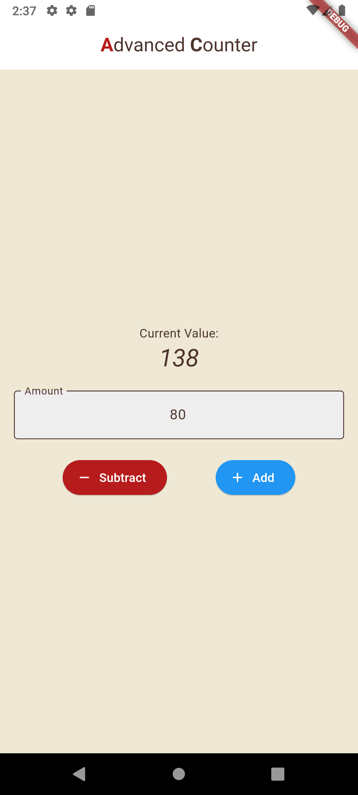

# Advanced Counter App

An enhanced, beautifully styled counter application built with Flutter. This project goes beyond a simple counter by adding features like custom increment/decrement amounts, a unique earthy color theme, and various UI customizations.

## ✨ Features

*   **Add & Subtract:** Increment or decrement the counter with dedicated buttons.
*   **Custom Amount:** Use the text field to specify the exact amount to add or subtract.
*   **Numeric Input Only:** The text field is restricted to accept only digits for a smoother user experience.
*   **Custom Earthy Theme:** A warm and inviting theme using red, orange, gold, and earth tones.
*   **Styled AppBar:** A centered AppBar title with dynamically colored capital letters for a unique look.
*   **Custom Buttons:** The "Subtract" button is styled in red, and the "Add" button is styled in blue for clear visual distinction.
*   **Styled Counter Display:** The main counter number is displayed in italics.
*   **Styled Text Field:** The input field has a light grey background to make it stand-out.

## 📸 Screenshots

*(Here you can add screenshots of your application)*



## 🚀 Getting Started

To get a local copy up and running, follow these simple steps.

### Prerequisites

Ensure you have the Flutter SDK installed on your machine. For installation instructions, see the [official Flutter documentation](https://docs.flutter.dev/get-started/install).

```sh
flutter --version
```

### Installation

1.  **Clone the repository**
    ```sh
    git clone https://github.com/your_username/your_repository_name.git
    ```
2.  **Navigate to the project directory**
    ```sh
    cd your_repository_name
    ```
3.  **Install dependencies**
    ```sh
    flutter pub get
    ```
4.  **Run the app**
    ```sh
    flutter run
    ```

## 🛠️ Built With

*   [Flutter](https://flutter.dev/) - The UI toolkit for building beautiful, natively compiled applications for mobile, web, and desktop from a single codebase.
*   [Dart](https://dart.dev/) - The programming language used by Flutter.
